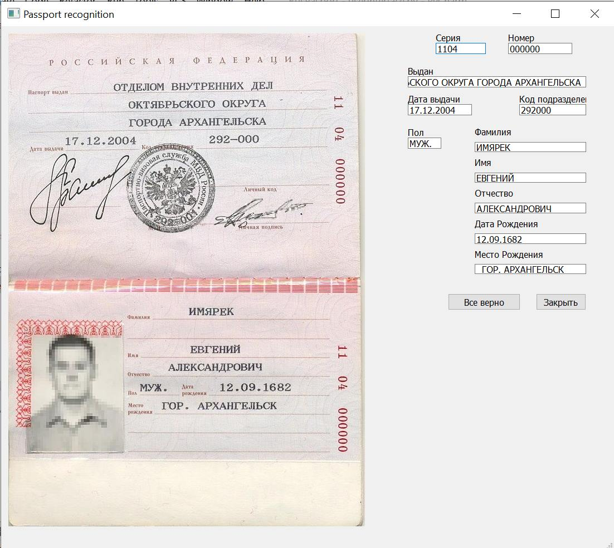
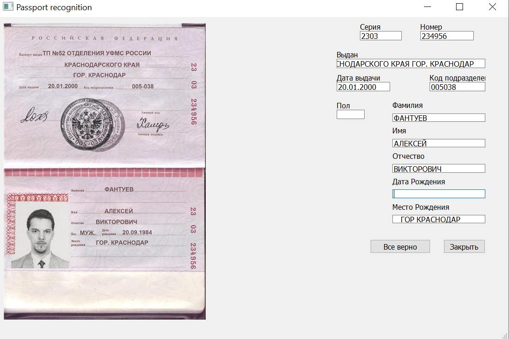

#***Распознавание сведений о личности владельца с паспорта Российской Федерации***
Авторы: Дзюба Александр Игоревич, Мамбетов Руслан Исмаилович

Данное программное обеспечение написанно на языке Python3 и использует для расспознавания текста библиотеку Tesseract.
Полученные данные выводятся при помощи интерфейса созданного с использованием pyQt5, с возможностью редактировать полученные данные, и сохраняют 
данные в json файл.

На текущий момент эфективность распознавания невысокая, требуется дальнейшая доработка решения.

###***Результаты распознавания***

Первый паспорт:

Второй паспорт:

